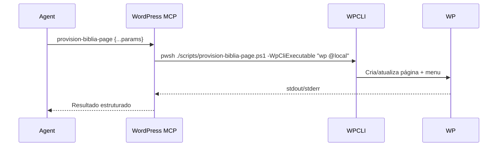

# WordPress MCP Bridge

Este diretório descreve como expor o fluxo WordPress (WP-CLI + scripts PowerShell) como um servidor MCP consumível pelos agentes configurados no `cline_mcp_settings.json`.

## Componentes

| Item | Descrição |
| --- | --- |
| `scripts/provision-biblia-page.ps1` | Script idempotente que cria/atualiza a página "Bíblia Online" e injeta no menu. |
| `wp-cli` | binário CLI (local ou remoto via alias `@production`). |
| `mcp/wordpress-cli/server.js` | Servidor SSE (Node) que recebe solicitações MCP e executa o script/CLI. |
| `cline_mcp_settings.json` | Aponta o cliente para `server.js` e define auto-approvals para comandos seguros. |

## Fluxo sugerido



## Servidor SSE de exemplo (Node)

```javascript
import express from "express";
import { spawn } from "node:child_process";

const app = express();
app.use(express.json());

app.post("/command", (req, res) => {
  const { command, args = {} } = req.body;
  if (command !== "provision-biblia-page") {
    return res.status(400).json({ error: "Comando não suportado" });
  }

  const pwshArgs = [
    "./scripts/provision-biblia-page.ps1",
    `-WpCliExecutable`, args.wpCliExecutable ?? "wp",
    `-WpStudioPath`, args.wpStudioPath ?? `${process.env.USERPROFILE}\\Studio\\httpsotimizaprolocal`,
    `-ThemeDirectory`, args.themeDirectory ?? "aculpaedasovelhas",
  ];

  const child = spawn("pwsh", pwshArgs, { cwd: process.cwd() });
  let output = "";
  child.stdout.on("data", (chunk) => (output += chunk));
  child.stderr.on("data", (chunk) => (output += chunk));
  child.on("close", (code) => {
    res.json({ code, output });
  });
});

app.listen(3010, () => console.log("WordPress MCP rodando na porta 3010"));
```

> Ajuste o servidor para o protocolo SSE requerido pelo MCP escolhido (Cline, Claude Dev Tools etc.). O exemplo acima ilustra apenas o invólucro HTTP.

## Configuração sugerida (`cline_mcp_settings.json`)

```jsonc
{
  "mcpServers": {
    "wordpress-cli": {
      "type": "sse",
      "url": "http://localhost:3010/sse",
      "timeout": 300,
      "autoApprove": [
        "provision-biblia-page",
        "wp cache flush"
      ]
    }
  }
}
```

- **`url`**: endpoint SSE exposto pelo seu `server.js` (ex.: `/sse`).
- **`autoApprove`**: mantenha apenas ações idempotentes que não exponham credenciais. Para comandos destrutivos use aprovação manual.

## Extensões futuras

1. Acrescentar outro comando MCP `sync-theme` que comprima o tema (`Compress-Archive`) e envia via SFTP.
2. Mapear aliases `wp @staging` e `wp @production` no `wp-cli.yml` e permitir seleção via `args.target`.
3. Integrar com 1Password CLI para recuperar senhas e injetar como variáveis de ambiente antes da execução do script.
